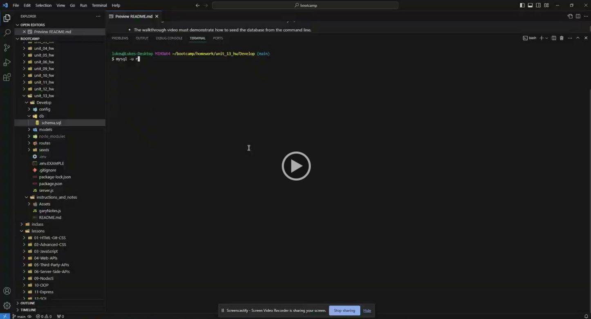

# E-Commerce Back End

## Description
This application allows the user to have a back end for their e-commerce website.

## Table of Contents
- [Installation](#installation)
- [Usage](#usage)
- [Questions](#questions)
- [Acknowledgements](#acknowledgements)
- [Preview](#preview)

  
## Installation
1) Download repository
2) Run 'npm install' in command line after downloading

## Usage
Once the user has entered their database name, MYSQL username, and MySQL password to an environment variable file, they are able to connect to a database using Sequalize. When they enter schema and seed commands, a development database is created and seeded with test data. When the user enters the command to invoke the application, their server is started and the Sequalize models are synced to the MySQL database.

When the user opens API GET routes in Insomnia for categories, products, or tags, then the data for each of these routes is displayed in a formatted JSON. When they test API POST, PUT, and DELETE routes in Insomnia, then they're able to successfully create, update, and delete data in their database

## Questions
Questions can be received on the [Github Repository](https://github.com/Wald14/e-commerce_back_end) for this application. Please make a new issue.

## Acknowledgements
- Gary Almes (Professor)
- Ben Martin and Katy Vincent (TA)
- [W3School](https://www.w3schools.com/)
- [MDN Web Docs](https://developer.mozilla.org/)
- [Stack Overflow](https://stackoverflow.com)

## Preview
A video of the application in use: 
